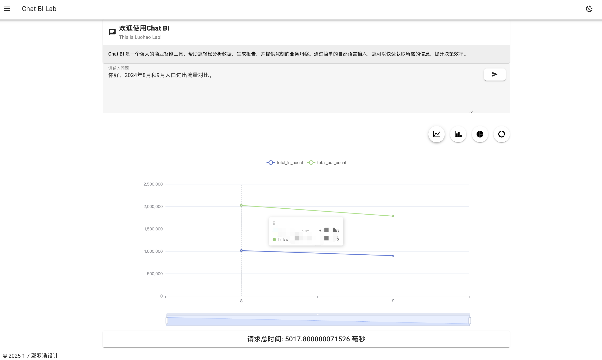
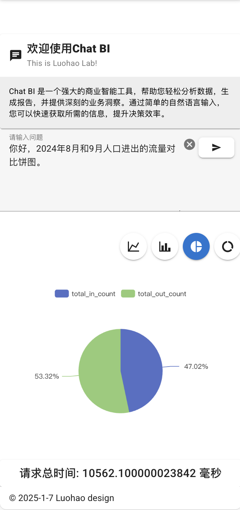

# ChatBI-POC

## 🎉 v2.0 重大升级 - 智能多数据集查询系统

> **最新版本**: v2.0 | **发布日期**: 2025-10-20

### ✨ 新功能亮点

🚀 **智能多数据集查询**: 支持同时选择多个数据集，AI自动分析问题并智能选择相关数据集进行查询

🧠 **动态SQL生成**: 根据实际数据集结构动态生成SQL，不再依赖固定的数据库表名

🔗 **多数据集联合查询**: 自动合并多个数据集的查询结果，支持跨数据集分析

💡 **智能决策引擎**: AI驱动的三层决策机制，从用户指定→向量检索→固定Schema智能回退

📊 **更高成功率**: 优化错误处理，用户指定数据集时不再盲目回退，大幅提升查询成功率

### 📖 详细文档

查看完整升级文档: [UPGRADE_SMART_MULTI_DATASET_QUERY.md](./UPGRADE_SMART_MULTI_DATASET_QUERY.md)

---

## 项目简介

ChatBI 是一个基于AI的智能商业智能（BI）分析平台，用户可以通过自然语言提问，系统自动生成图表和数据分析。

**核心能力**:
- 📁 支持上传多种格式数据（CSV、Excel等）
- 💬 自然语言问答，无需编写SQL
- 📈 自动生成可视化图表（柱状图、折线图、饼图等）
- 🎯 智能多数据集联合分析
- 🔍 向量检索自动匹配相关数据集
- 🤖 AI驱动的洞察分析

## 启动UI效果
<div style="display: flex; flex-wrap: wrap;">
  
  
  
  
  
  
  
  
</div>

# 环境准备
## 安装激活chatbi 虚拟环境
```
conda activate chatbi
```
## 使用 pip 安装 requirements.txt 文件中的库
```
pip install -r requirements.txt
```
## 运行docker 启动PG数据库
```
docker-compose up -d
```
## 初始化数据库
```
python backend/init_db.py
```

运行后会根据用户的问题生成一张图表。

# 前端项目创建流程
## 前端项目使用的是Vuetify+Vue+Vite5+Typescript
使用命令创建前端项目：`pnpm create vuetify`
```
success Installed "create-vuetify@x.x.x" with binaries:
    - create-vuetify

? Project name (项目名): ❯ vuetify-project //生成应用程序的文件夹
? Use TypeScript (使用 TypeScript)?: ❯ No / Yes
? Would you like to install dependencies with yarn, npm, or pnpm?:
    yarn
    npm
  ❯ pnpm
    bun
    none
```

- 创建后设置项目的名称并选择项目创建的方式（如下所示）：
```
Vuetify.js - Material Component Framework for Vue

✔ Project name: … chatbi
? Which preset would you like to install? › - Use arrow-keys. Return to submit.
    Barebones (Only Vue & Vuetify)
❯   Default (Adds routing, ESLint & SASS variables)
    Recommended (Everything from Default. Adds auto importing, layouts & pinia)
    Nuxt Barebones (Only Vuetify)
    Nuxt Default (Adds Nuxt ESLint & SASS variables)
    Nuxt Recommended (Everything from Default. Enables auto importing & layouts)
```
- 初学者或者希望快速搭建一个功能齐全的项目，建议选择Recommended预设：`Recommended (Everything from Default. Adds auto importing, layouts & pinia)`

选项说明
- Barebones (Only Vue & Vuetify): 仅包含Vue和Vuetify，适合希望从头开始配置项目的开发者。
- Default (Adds routing, ESLint & SASS variables): 包含路由、ESLint和SASS变量，适合大多数项目的基础配置。
- Recommended (Everything from Default. Adds auto importing, layouts & pinia): 包含Default预设的所有内容，并增加了自动导入、布局和Pinia状态管理，适合希望快速上手并使用更多功能的开发者。
- Nuxt Barebones (Only Vuetify): 仅包含Nuxt和Vuetify，适合希望从头开始配置Nuxt项目的开发者。
- Nuxt Default (Adds Nuxt ESLint & SASS variables): 包含Nuxt的基础配置，适合大多数Nuxt项目。
- Nuxt Recommended (Everything from Default. Enables auto importing & layouts): 包含Nuxt Default预设的所有内容，并增加了自动导入和布局，适合希望快速上手并使用更多功能的Nuxt开发者。
...
```

   ╭──────────────────────────────────────────────────────────────────╮
   │                                                                  │
   │                Update available! 8.14.1 → 9.15.3.                │
   │   Changelog: https://github.com/pnpm/pnpm/releases/tag/v9.15.3   │
   │                Run "pnpm add -g pnpm" to update.                 │
   │                                                                  │
   │      Follow @pnpmjs for updates: https://twitter.com/pnpmjs      │
   │                                                                  │
   ╰──────────────────────────────────────────────────────────────────╯

Packages: +246
++++++++++++++++++++++++++++++++++++++++++++++++++++++++++++++++++++++++++++++++++++++++++++++++++
Progress: resolved 305, reused 163, downloaded 83, added 246, done
node_modules/.pnpm/core-js@3.39.0/node_modules/core-js: Running postinstall script, done in 228ms
node_modules/.pnpm/vue-demi@0.14.10_vue@3.5.13/node_modules/vue-demi: Running postinstall script, done in 260ms
node_modules/.pnpm/esbuild@0.21.5/node_modules/esbuild: Running postinstall script, done in 409ms

dependencies:
+ @mdi/font 7.4.47
+ core-js 3.39.0
+ roboto-fontface 0.10.0
+ vue 3.5.13
+ vuetify 3.7.6

devDependencies:
+ @eslint/js 9.17.0
+ @tsconfig/node22 22.0.0
+ @types/node 22.10.5
+ @vitejs/plugin-vue 5.2.1
+ @vue/eslint-config-typescript 14.2.0
+ @vue/tsconfig 0.5.1 (0.7.0 is available)
+ eslint 9.17.0
+ eslint-plugin-vue 9.32.0
+ npm-run-all2 7.0.2
+ pinia 2.3.0
+ sass 1.77.8 (1.83.0 is available)
+ sass-embedded 1.83.1
+ typescript 5.6.3 (5.7.2 is available)
+ unplugin-auto-import 0.17.8 (0.19.0 is available)
+ unplugin-fonts 1.3.1
+ unplugin-vue-components 0.27.5 (0.28.0 is available)
+ unplugin-vue-router 0.10.9
+ vite 5.4.11 (6.0.7 is available)
+ vite-plugin-vue-layouts 0.11.0
+ vite-plugin-vuetify 2.0.4
+ vue-router 4.5.0
+ vue-tsc 2.2.0

Done in 13.3s

chatbi has been generated at /Users/yanluohao/开发/chatbi-poc/frontend/chatbi

Discord community: https://community.vuetifyjs.com
Github: https://github.com/vuetifyjs/vuetify
Support Vuetify: https://github.com/sponsors/johnleider
```

## GitHub 项目 Star 数


## Star 历史
[](https://starchart.cc/Luohao-Yan/chatbi-poc)

## 贡献者
感谢以下所有贡献者：

[](https://github.com/Luohao-Yan/chatbi-poc/graphs/contributors)

# git 提交代码到GitHub仓库

1. 初始化本地 Git 仓库`git init`
2. 添加远程仓库
    - 将你的本地仓库与 GitHub 仓库关联：`git remote add origin https://github.com/your_username/chatbi-poc.git`
3. 添加文件并提交
    - 添加所有文件并提交：
```
git add .
git commit -m "Initial commit"
```
4. 推送到 GitHub
将代码推送到 GitHub 仓库：`git push -u origin main`
5. 确保你在项目根目录
6. 检查当前状态
    - 使用 git status 命令查看当前的更改状态：`git status`
7. 添加更改的文件
    - 将更改的文件添加到暂存区。你可以添加所有更改的文件：`git add .`
    - 或者只添加特定的文件：`git add path/to/your/file`
8. 提交更改
    - 使用 git commit 命令提交更改，并添加提交信息：`git commit -m "描述你的更改"`
9. 推送到 GitHub
    - 将更改推送到 GitHub 仓库：`git push origin main`
